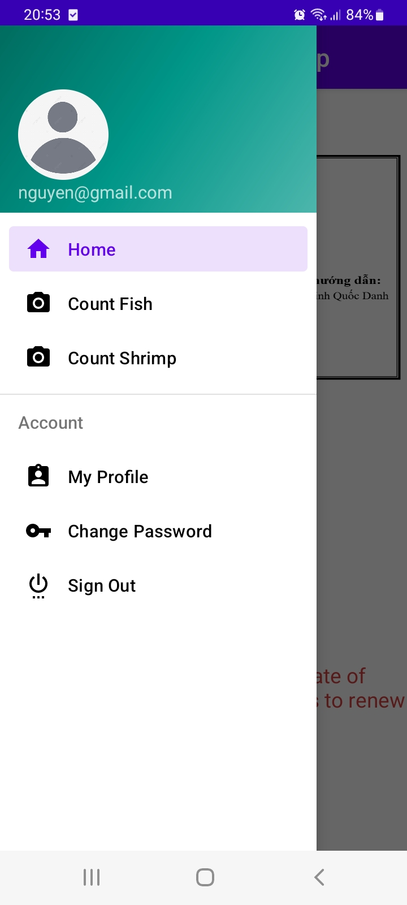
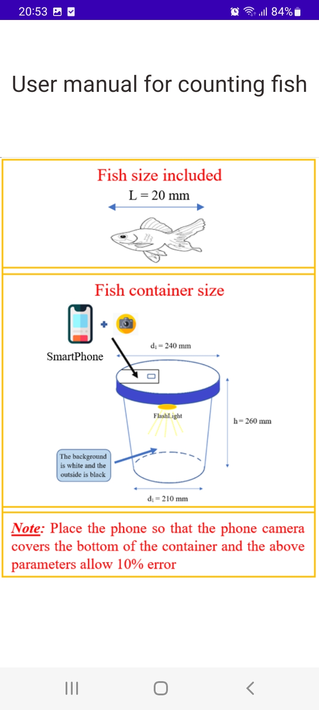
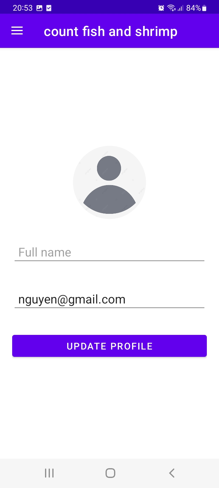
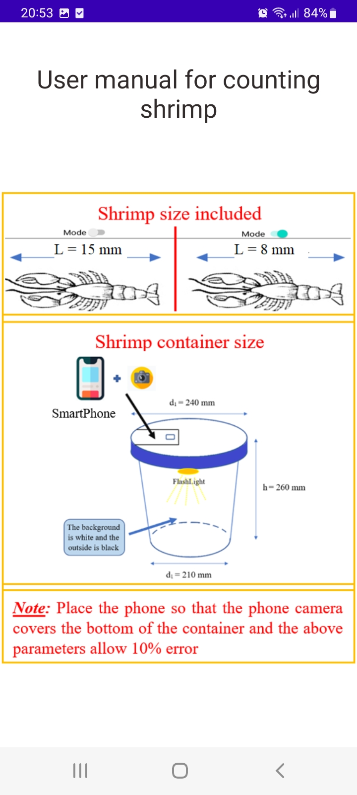
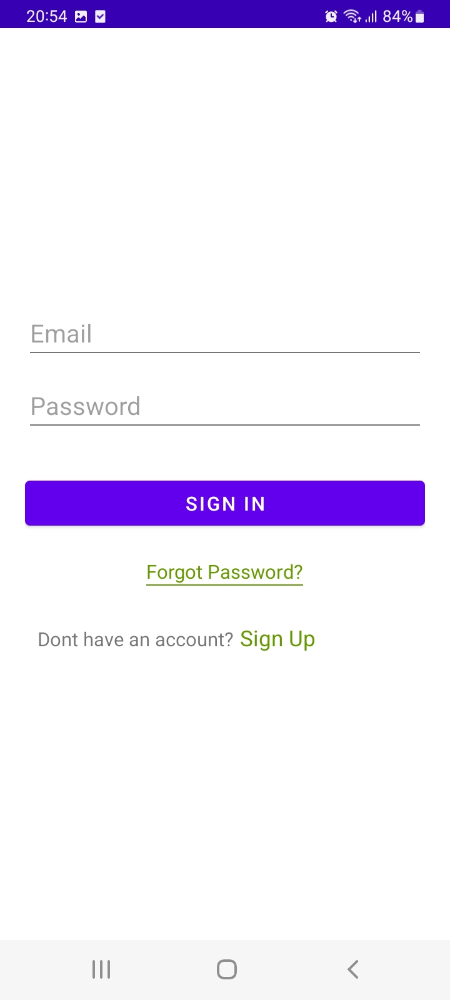

# App Count-Fish-and-Shrimp

App android used for counting the number of shrimp and fish fingerlings. Graduation thesis from College of Engineering - CanTho University

## Source Code
located in the source folder

## Build the project
Use 'Android Studio' environment

